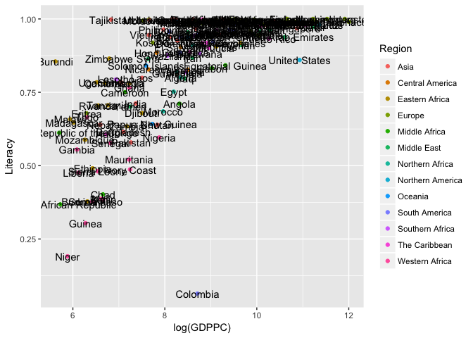
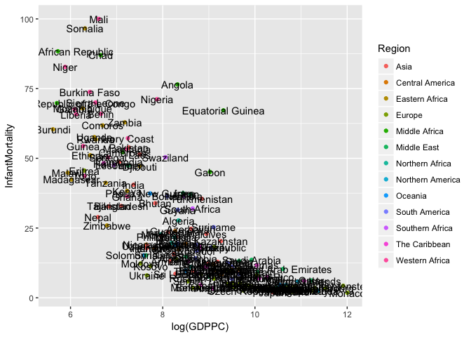
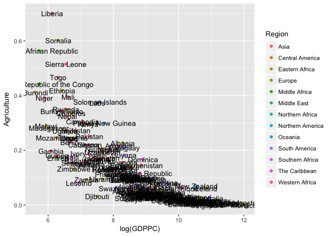
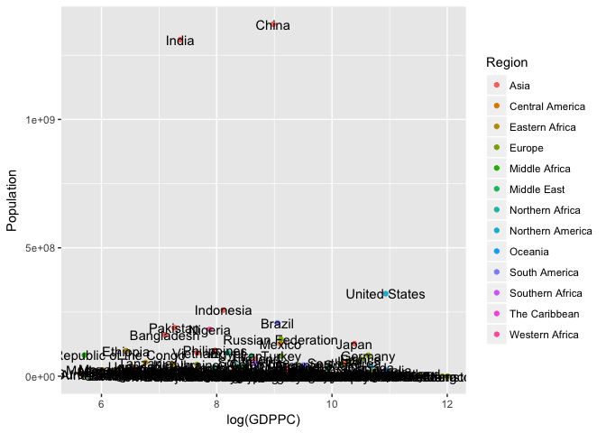
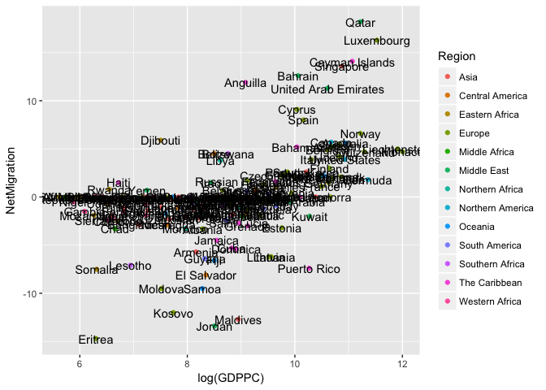

Country
================

    ## ── Attaching packages ────────────────────────────────── tidyverse 1.2.1 ──

    ## ✔ tibble  1.4.2     ✔ purrr   0.2.4
    ## ✔ tidyr   0.7.2     ✔ dplyr   0.7.4
    ## ✔ readr   1.1.1     ✔ stringr 1.2.0
    ## ✔ tibble  1.4.2     ✔ forcats 0.2.0

    ## ── Conflicts ───────────────────────────────────── tidyverse_conflicts() ──
    ## ✖ dplyr::filter() masks stats::filter()
    ## ✖ dplyr::lag()    masks stats::lag()

    ## 
    ## Attaching package: 'scales'

    ## The following object is masked from 'package:purrr':
    ## 
    ##     discard

    ## The following object is masked from 'package:readr':
    ## 
    ##     col_factor

    ## 
    ## Attaching package: 'plotly'

    ## The following object is masked from 'package:ggplot2':
    ## 
    ##     last_plot

    ## The following object is masked from 'package:stats':
    ## 
    ##     filter

    ## The following object is masked from 'package:graphics':
    ## 
    ##     layout

    ## PhantomJS not found. You can install it with webshot::install_phantomjs(). If it is installed, please make sure the phantomjs executable can be found via the PATH variable.



``` r
plot2 = ggplot(countries, aes(x = log(GDPPC), y = InfantMortality)) + 
  geom_point(aes(colour = Region)) +
  geom_text(aes(label = Name), position=position_jitter())
  labs(title = "GDP Per Capita and Infant mortality Rate acrross different region", x = "GDP per Capita", y = "Infant Mortality Rate")
```

    ## $title
    ## [1] "GDP Per Capita and Infant mortality Rate acrross different region"
    ## 
    ## $x
    ## [1] "GDP per Capita"
    ## 
    ## $y
    ## [1] "Infant Mortality Rate"
    ## 
    ## attr(,"class")
    ## [1] "labels"

``` r
plot2
```



``` r
plot3 = ggplot(countries, aes(x = log(GDPPC), y = Agriculture)) + 
  geom_point(aes(colour = Region)) +
  geom_text(aes(label = Name), position=position_jitter())
  labs(title = "GDP Per Capita and Agriculture acrross different region", x = "GDP per Capita", y = "Agriculture")
```

    ## $title
    ## [1] "GDP Per Capita and Agriculture acrross different region"
    ## 
    ## $x
    ## [1] "GDP per Capita"
    ## 
    ## $y
    ## [1] "Agriculture"
    ## 
    ## attr(,"class")
    ## [1] "labels"

``` r
plot3
```



``` r
plot4 = ggplot(countries, aes(x = log(GDPPC), y = Population)) + 
  geom_point(aes(colour = Region)) +
  geom_text(aes(label = Name), position=position_jitter())
  labs(title = "GDP Per Capita and Population acrross different region", x = "GDP per Capita", y = "Population")
```

    ## $title
    ## [1] "GDP Per Capita and Population acrross different region"
    ## 
    ## $x
    ## [1] "GDP per Capita"
    ## 
    ## $y
    ## [1] "Population"
    ## 
    ## attr(,"class")
    ## [1] "labels"

``` r
plot4
```



``` r
plot5 = ggplot(countries, aes(x = log(GDPPC), y = NetMigration)) + 
  geom_point(aes(colour = Region)) +
  geom_text(aes(label = Name), position=position_jitter())
  labs(title = "GDP Per Capita and Net Migration acrross different region", x = "GDP per Capita", y = "Net Migration")
```

    ## $title
    ## [1] "GDP Per Capita and Net Migration acrross different region"
    ## 
    ## $x
    ## [1] "GDP per Capita"
    ## 
    ## $y
    ## [1] "Net Migration"
    ## 
    ## attr(,"class")
    ## [1] "labels"

``` r
plot5
```


