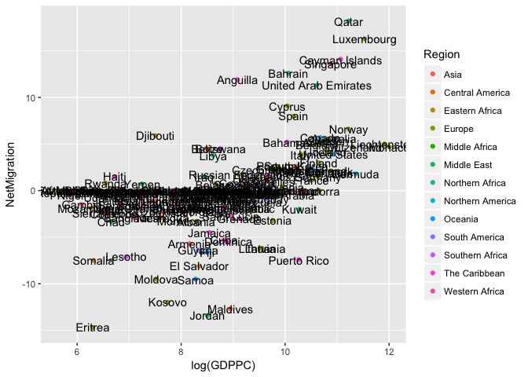

Country
================

    ## ── Attaching packages ────────────────────────────────── tidyverse 1.2.1 ──

    ## ✔ tibble  1.4.2     ✔ purrr   0.2.4
    ## ✔ tidyr   0.7.2     ✔ dplyr   0.7.4
    ## ✔ readr   1.1.1     ✔ stringr 1.2.0
    ## ✔ tibble  1.4.2     ✔ forcats 0.2.0

    ## ── Conflicts ───────────────────────────────────── tidyverse_conflicts() ──
    ## ✖ dplyr::filter() masks stats::filter()
    ## ✖ dplyr::lag()    masks stats::lag()

    ## 
    ## Attaching package: 'scales'

    ## The following object is masked from 'package:purrr':
    ## 
    ##     discard

    ## The following object is masked from 'package:readr':
    ## 
    ##     col_factor

    ## 
    ## Attaching package: 'plotly'

    ## The following object is masked from 'package:ggplot2':
    ## 
    ##     last_plot

    ## The following object is masked from 'package:stats':
    ## 
    ##     filter

    ## The following object is masked from 'package:graphics':
    ## 
    ##     layout

    ## Observations: 170
    ## Variables: 9
    ## $ Country         <int> 1, 2, 3, 4, 5, 6, 7, 8, 9, 10, 11, 12, 13, 14,...
    ## $ Name            <fct> Albania, Algeria, Andorra, Angola, Anguilla, A...
    ## $ GDPPC           <int> 3965, 4206, 42500, 4102, 8800, 13432, 3499, 56...
    ## $ Literacy        <dbl> 0.987, 0.800, 1.000, 0.711, 0.950, 0.981, 0.99...
    ## $ InfantMortality <dbl> 14.0, 27.7, 3.6, 76.5, 3.4, 11.1, 13.1, 3.2, 3...
    ## $ Agriculture     <dbl> 0.227, 0.107, 0.006, 0.050, 0.029, 0.082, 0.21...
    ## $ Population      <int> 3038594, 39670000, 86165, 25020000, 15000, 434...
    ## $ NetMigration    <dbl> -3.3, -0.9, 0.0, -0.1, 11.9, -0.1, -5.7, 5.6, ...
    ## $ Region          <fct> Europe, Northern Africa, Europe, Middle Africa...


``` r
plot2 = ggplot(countries, aes(x = log(GDPPC), y = InfantMortality)) + 
  geom_point(aes(colour = Region)) +
  geom_text(aes(label = Name), position=position_jitter())
  labs(title = "GDP Per Capita and Infant mortality Rate acrross different region", x = "GDP per Capita", y = "Infant Mortality Rate")
```

    ## $title
    ## [1] "GDP Per Capita and Infant mortality Rate acrross different region"
    ## 
    ## $x
    ## [1] "GDP per Capita"
    ## 
    ## $y
    ## [1] "Infant Mortality Rate"
    ## 
    ## attr(,"class")
    ## [1] "labels"

``` r
plot2
```


``` r
plot3 = ggplot(countries, aes(x = log(GDPPC), y = Agriculture)) + 
  geom_point(aes(colour = Region)) +
  geom_text(aes(label = Name), position=position_jitter())
  labs(title = "GDP Per Capita and Agriculture acrross different region", x = "GDP per Capita", y = "Agriculture")
```

    ## $title
    ## [1] "GDP Per Capita and Agriculture acrross different region"
    ## 
    ## $x
    ## [1] "GDP per Capita"
    ## 
    ## $y
    ## [1] "Agriculture"
    ## 
    ## attr(,"class")
    ## [1] "labels"

``` r
plot3
```


``` r
plot4 = ggplot(countries, aes(x = log(GDPPC), y = Population)) + 
  geom_point(aes(colour = Region)) +
  geom_text(aes(label = Name), position=position_jitter())
  labs(title = "GDP Per Capita and Population acrross different region", x = "GDP per Capita", y = "Population")
```

    ## $title
    ## [1] "GDP Per Capita and Population acrross different region"
    ## 
    ## $x
    ## [1] "GDP per Capita"
    ## 
    ## $y
    ## [1] "Population"
    ## 
    ## attr(,"class")
    ## [1] "labels"

``` r
plot4
```


``` r
plot5 = ggplot(countries, aes(x = log(GDPPC), y = NetMigration)) + 
  geom_point(aes(colour = Region)) +
  geom_text(aes(label = Name), position=position_jitter())
  labs(title = "GDP Per Capita and Net Migration acrross different region", x = "GDP per Capita", y = "Net Migration")
```

    ## $title
    ## [1] "GDP Per Capita and Net Migration acrross different region"
    ## 
    ## $x
    ## [1] "GDP per Capita"
    ## 
    ## $y
    ## [1] "Net Migration"
    ## 
    ## attr(,"class")
    ## [1] "labels"

``` r
plot5
```


